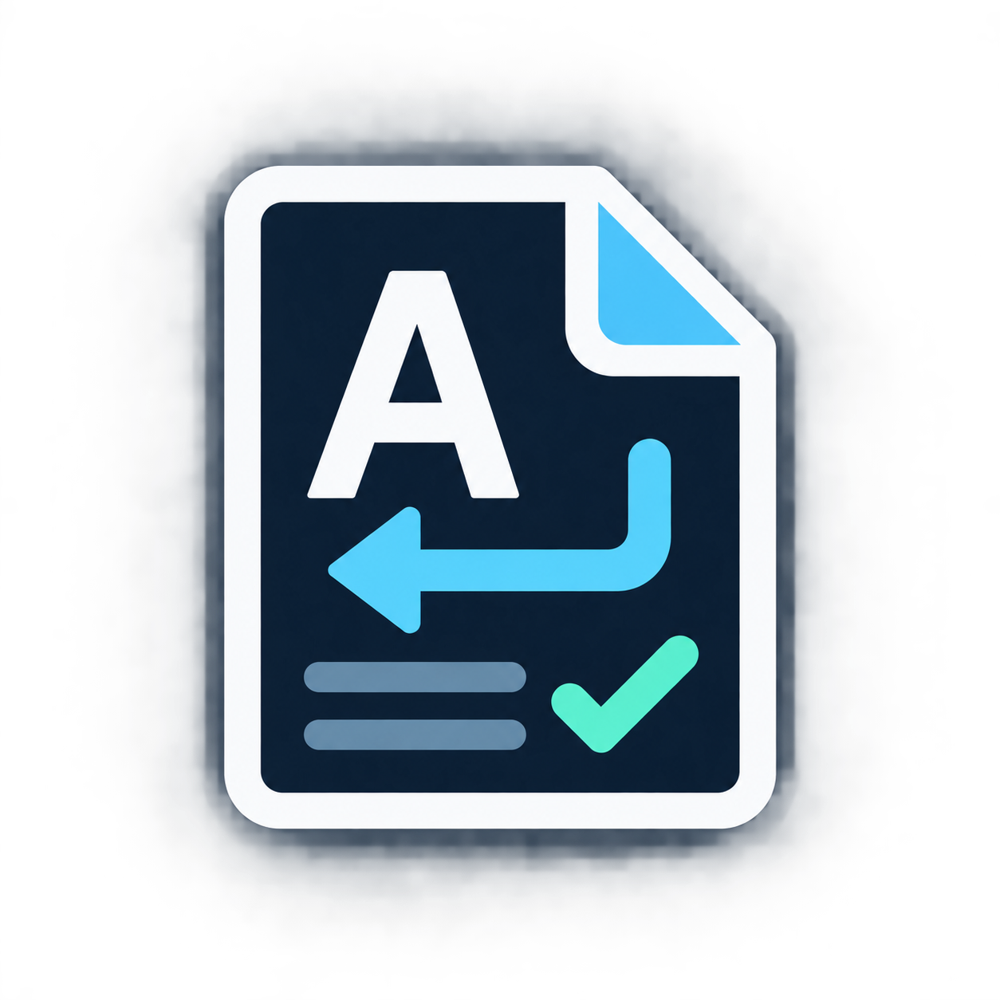

# 文字コード・改行チェック

ローカルファイルのワークスペース向けに、ファイル／フォルダー単位の文字コードと改行コードを確認する VS Code 拡張機能です。仮想ワークスペースでは、安全な上限付き読み込みを保証できないため動作対象外です。

プロジェクト内のフォルダーごとに期待する文字コードを登録し、文字コード・改行の不一致や変更を見つけやすくします。選択したファイルの文字コード・改行コードをまとめて変換することもできます。

発行者名は **encoding-tools**、拡張IDは `encoding-tools.folder-encoding-guard` です。旧表示名は **Folder Encoding Guard** です。

### 0.11以前からの切り替え

0.12から発行者名を `encoding-tools` に変更したため、VS Codeでは別の拡張として扱われます。

1. 以前の変換を元に戻す必要がある場合は、旧版で先に復元してください。
2. 旧版を無効化し、新版のVSIXをインストールしてください。同時に有効にしないでください。
3. 設定キー `folderEncodingGuard.*` は同じなので、ファイル・フォルダーのルールはそのまま使えます。新しい拡張でフォルダーを調べ直してください。

旧版の操作記録・確認済み状態・復元用データは自動移行しません。必要な記録を旧版で確認してから切り替えてください。


## 使い方

**文字コード・改行の状況** の虫眼鏡 **範囲を選んで解析** から、現在の1ファイル、選択したファイル、選択したフォルダー、ワークスペース全体を選べます。エクスプローラーで複数のファイルを選び、右クリックから解析することもできます。小さい範囲から結果を確認して、次のフォルダーへ進められます。更新ボタンは直前に選んだ範囲を再確認します。

今回の対象は **確認範囲** に表示します。限定解析は未選択のファイルの比較基準を消しません。ファイルを直接指定した場合は全体の列挙を行わず、そのファイルだけを調べます。フォルダーは除外設定に従い、まず最大100候補だけ解析します。ファイルが多くても件数超過で全体を中止せず、残りは **続きを解析** で進められます。直接指定したファイルは除外globより選択を優先しますが、サイズ制限やバイナリ・未保存の除外は維持します。

**期待する文字コード** は「このファイルを何の文字コードとして扱いたいか」の設定です。設定なしでも解析でき、判定できない場合はその旨を表示します。特定の形式へ自動変換する設定ではありません。

1. エクスプローラーで対象ファイルまたはフォルダーを右クリックします。
2. **このファイルの文字コードを設定** または **このフォルダーの文字コードを設定** を選びます。
3. `UTF-8`、`Shift JIS / CP932` などを選びます。ファイルを選んだ場合はその1ファイルだけに適用します。

設定はワークスペースフォルダーの `.vscode/settings.json` に保存されます。

```json
{
  "folderEncodingGuard.rules": [
    {
      "pattern": "legacy/**",
      "encoding": "shiftjis"
    }
  ]
}
```

新しいファイル／フォルダーの設定は先頭に追加されるため優先されます。同じパターンの再設定では位置を維持します。**期待する文字コード** の一覧で、複数の設定に一致するファイルには上の設定を適用します。右クリックから文字コードの変更と順序の移動ができます。「1位・2位」という表示は使いません。選択中に設定が変わった場合は古い一覧から上書きしません。

## Git比較の文字コード

比較画面では、ステータスバーに **左 Git版: Shift JIS / 右 作業中: UTF-8** のように左右の読み込み文字コードを表示します。これはエディターが読み込む際の設定で、保存バイト列を断定する表示ではありません。

この拡張の **期待値で開き直す** を選んでも左右の比較を維持します。Git履歴側への重複した不一致警告は出しません。未保存の内容は開き直さず、ファイルの保存や変換は行いません。

## 既存ファイルを変換

1. エクスプローラーで対象フォルダーを右クリックします。
2. **文字コード・改行チェック: このフォルダー内の既存ファイルを変換** を選びます。
3. 「文字コードのみ」「改行コードのみ」「両方」を選びます。必要に応じて変換先のLF/CRLFと、読み込みに使う現在の文字コードを選びます。文字コードの変換先はフォルダールールを優先します。
4. 候補外のファイルがある場合は通知の **対象外の理由を見る** でパスと理由を確認できます。変換不要、未保存、サイズ超過、読み込み文字コードの不一致、変換先で表現できない文字、バイナリ、読み取り失敗などを区別します。除外globに一致するファイルは列挙対象外で、この一覧にも含めません。
5. 内容プレビューと文字コード・改行の変更前後が付いた候補一覧で、変換するファイルだけを選択します。文字コードの判定が不確実な候補は「要確認」として未選択にし、明示的に選んだ場合だけ変換します。
6. 件数と変換方向を確認して実行します。前回の通常の復元データがある場合は、新しい変換の成功後に置き換わり、前回の変換を元に戻せなくなることを同じ確認画面に表示します。復元未完了の保護データには従来の保持確認を使います。

変換時には次の安全確認を行います。

- 変換元の文字コードでバイト列を往復できないファイルは除外
- 変換先で表現できない文字を含むファイルは除外
- バイナリ、サイズ上限超過、未保存のファイルは除外
- `.git`、`.vscode`、`node_modules`、ビルド出力などは既定で除外
- 確認画面の後で変更されたファイルはスキップ
- 変換前のバイト列と SHA-256 を拡張のローカルストレージへ退避
- 1回の変換で退避する合計サイズは512 MiBまで（超える場合は選択を分割）

変換直後の通知、またはコマンドパレットの **文字コード・改行チェック: 直前の一括変換を元に戻す** から復元できます。変換後に編集されたファイルは復元で上書きしません。

文字コードの変換はバイト表現を変える機能です。すでに文字化けした文字列として上書きされ、元の文字情報が失われている場合は自動復元できません。その場合は Git の過去版やバックアップからの復旧が必要です。

## 確認できる場所

**確認範囲** にワークスペースフォルダーごとの「全体」または「ルール対象のみ」を表示します。ツールチップで対象glob・除外設定・件数とサイズ上限を確認できます。状況には確認済みと未確認の件数を表示し、要注意がなくても未確認ファイルを「問題なし」には含めません。**未確認の内訳** から各ファイルのパスと理由（未保存、サイズ超過、読み取り失敗、検査中の変更、バイナリなど）を確認し、クリックで開けます。除外globで列挙しないファイルは含みません。

- エクスプローラー内の **文字コード・改行の状況**: `ルール`、文字コード・改行コード別の `状況`、不一致・判定不明・改行混在・基準からの文字コード・改行変更の `要注意` を表示
- エクスプローラー: 対象ファイルに `SJ`、`U8` などの期待値バッジを表示。スキャン後の不一致は赤い `!`、判定不明は黄色い `?`、改行混在・変更は黄色い `↵` で上書き
- ステータスバー: 現在開いている文字コードと期待値の一致状態を表示
- Problems: 異なる文字コードで開かれた文書を警告
- 現在のファイルを確認: 文書の文字コードと、保存済みファイルの改行形式・混在を表示。未保存の場合は編集内容を調べ、どちらの結果かを明示。保存済みファイルの読み取りにもサイズ上限を適用
- 保存時: 文字コードとルールが異なる場合に通知。通知は保存を停止せず、回答も待ちません。保存後の自動書き直しは行いません

**文字コード・改行の状況** の更新ボタンを押した時だけスキャンします。ASCII だけのファイルと空ファイルは互換扱いにし、プロジェクト内で設定されている複数の文字コードで同じバイト列を表せる場合は推測せず `判定不明` として表示します。改行コードは `LF`、`CRLF`、`CR`、`改行なし` を集計し、同じファイル内の混在と改行形式の変更を要注意に表示します。混在状態では `LF + CRLF` から `LF + CR` のような種類構成の変更も検知します。Git管理下ではHEADコミットを比較基準にするため、初回スキャン前の変更も検知します。Gitが同じ内容と判定する物理的な改行変更も、同じHEADに対する前回スキャンの基準から検知します。ブランチ切り替えなどでHEADが変わった時は、新しいHEADを基準に取り直します。Git管理外では最初の完了スキャンを比較基準にし、その基準を自動更新しません。要注意項目をクリックすると対象ファイルを開き、文字コードに問題がある項目では右側の変換アイコンから、項目の期待文字コードを引き継いで親フォルダーの既存ファイル変換へ進めます。

改行コードの混在や変更は意図的な場合もあるため、この拡張は注意表示だけを行います。ファイルを自動修正したり、保存を強制したりはしません。

`.gitattributes` に `eol=lf` または `eol=crlf` がある場合は、Gitが解決した実効値と現在のファイルを比較します。意図的な改行混在は要注意項目のチェックアイコンからファイル・フォルダー単位で許容でき、直後の通知から取り消せます。許容しても文字コード不一致、改行形式の変更、`.gitattributes` 不一致は非表示になりません。

`.gitattributes` の確認は `folderEncodingGuard.useGitAttributes` でワークスペースフォルダーごとに切り替えられます。履歴との改行比較はこの設定に関係なく継続します。現在の状態は `状況` の `Git確認` に表示されます。VS CodeのGit機能を利用できない、対象がGitリポジトリとして認識されていない、またはGit規則・履歴を安全に読み取れない場合は、状態が変わった最初のスキャンだけ通知します。

HEADとの比較では、HEAD時点の `.gitattributes` と現在の `.gitattributes` を分けて確認し、Gitオブジェクトの生データへGit標準の改行変換だけを反映します。外部filter、textconv、fsmonitor hookは実行しません。rename前のHEADと比較するには、`git mv` または `git add -A` などでrenameをindexへ反映してから更新してください。未stageまたは片側だけをstageしたrenameは新規ファイルとして扱います。複数の同一内容ファイルを同時にrenameするなど、元パスを一意に確定できない場合は履歴比較を行わず読み取り失敗として表示します。ローカルファイルとHEADデータの読み込みは1ファイルごとに `maxFileSizeKB`（最大32 MiB）、HEADはさらに1スキャン合計128 MiBまでです。上限を超えたファイル、partial clone、外部filter、または `check-attr --source` を利用できない古いGitでは、リモート取得やfilter実行をせずに読み取り失敗を表示し、以後の変更を確認できるローカル基準を残します。Gitリモートへの接続は行いません。

スキャン結果は設定変更や一括変換後にクリアされます。確認対象ファイルの編集・外部変更・作成・削除を検知した場合も古い結果とスキャン由来のバッジを取り下げ、「変更あり・再確認が必要」と表示します。スキャン中の変更ではその結果を破棄し、同じ手動操作の中で1回だけ再試行します。変更が続く場合は再確認の案内を残し、ユーザーがキャンセルした場合は再試行しません。更新ボタンで再確認してください。ファイル監視はVS Codeの監視除外設定にも従うため、監視対象外の外部変更は手動で更新してください。スキャンにも `conversionExclude`、`maxScanFiles`、`maxFileSizeKB` を使用します。

文字コードの変更は、最初に文字コードを判定できた完了スキャンを基準に `UTF-8 → Shift JIS` の形と `Δ` バッジで表示します。更新ボタンで再比較しても基準は維持します。ASCII・判定不明は文字コードの変更と断定しません。文字コードの基準はGit HEADではなくローカル保存で、適用ルールの文字コードを変えると取り直します。ブランチ切り替えによる文字コード変更も注意対象です。

意図的な改行混在はチェックアイコンから「このファイルだけ」「このフォルダー以下」を選べます。フォルダー許容は `allowedMixedLineEndings` に末尾 `/` の相対パスとして保存します（ワークスペース全体は `./`）。混在の注意だけを抑え、文字コード・改行の変更とルール不一致は引き続き表示します。文字コードを意図的に使い分ける場合は、既存のファイル・フォルダー別ルールで期待値を指定してください。

許容した対象は同じツリーの `改行混在の扱い` に一覧表示され、右クリックから解除できます。意図した文字コード変更は、検出結果の右クリックから `文字コード変更を確認済みにする` を選ぶと、ローカルの文字コード比較基準だけを更新できます。ファイルは書き換えず、ルール不一致・改行の変更・Git HEADとの差は残します。表示後にファイルや基準が変わった場合、または未保存の場合は受け付けず、再確認を促します。

既定では注意表示のみです。必要な場合だけ `autoReopen` で自動の開き直しを有効にできますが、未保存の内容は開き直しません。保存後の自動書き直しは、連続保存を上書きする競合を防ぐため廃止しました。旧設定 `enforceOnSave` は保存時の警告として扱います。保存済みファイルの文字コードを変える場合は、候補を確認したうえで明示的な変換操作を使用してください。

## ソース管理について

この拡張は、VS Code が開く通常ファイルと読み取り可能な SCM 文書に同じルールを適用します。Git リポジトリ内の保存形式も統一したい場合は、別途 `.gitattributes` の `working-tree-encoding` を検討してください。既存リポジトリへ追加する場合は再正規化による大きな差分が発生し得るため、導入前に必ず差分を確認してください。

例:

```gitattributes
legacy/** text working-tree-encoding=SHIFT-JIS
```

## 開発

```sh
npm ci
npm run check
npm run package
```

生成された `.vsix` は VS Code の **Extensions: Install from VSIX...** からインストールできます。

実際のVS Code Extension Hostで操作フローを検証する場合は `npm run test:host` を実行します。macOSでは標準インストール先のVS Codeを使い、それ以外の環境では `VSCODE_EXECUTABLE` にVS Code実行ファイルを指定してください。GUIを起動できる環境とGitが必要です。テスト専用の一時ワークスペース・プロファイルを作成し、終了後に削除します。混在許容と解除、変更の再検知、確認済み操作、Git差分の維持、変換と復元を確認します。ダイアログの回答だけを自動化し、画面描画の見た目は検査しません。通常の `check` / CIとは別の任意実行です。方式は[VS Code公式の拡張テスト](https://code.visualstudio.com/api/working-with-extensions/testing-extension)に従います。

### ソースの構成

入口は `src/extension.ts` です。イベント・コマンドの登録と、スキャンや保存中の状態管理をまとめています。

| リポジトリ内のパス | 責務 |
| --- | --- |
| `src/workspaceRules.ts` | 設定の読み取り、対象パスと適用ルールの解決 |
| `src/ruleCommands.ts` | フォルダールールの追加・削除 |
| `src/encodingCommands.ts` | 文字コード変更の確認済み操作・混在許容の解除 |
| `src/encodingView.ts` | ツリー一覧、エクスプローラーのバッジ、Git確認の通知 |
| `src/editorEncoding.ts` | 文書の診断、ステータスバー、開き直し、保存時の警告 |
| `src/scanner.ts` / `src/scanCore.ts` | スキャンの実行 / 文字コード・改行の判定 |
| `src/conversion.ts` | 変換の入口・排他制御・書き込みと結果通知 |
| `src/conversionSelection.ts` | 変換項目・候補一覧・プレビュー・実行前確認 |
| `src/conversionRecovery.ts` | 直前の変換の復元と復元失敗時の確認 |
| `src/conversionBackup.ts` | バックアップ記録・保存先検証・読み書き・削除 |
| `src/conversionResources.ts` / `src/conversionCore.ts` | VS Codeの文書・文字コードAPI接続 / 変換内容と書き込み手順の検証 |
| `src/gitIntegration.ts` / `src/gitRepositoryInspection.ts` | VS CodeのGit連携 / リポジトリの規則・履歴の読み取り |
| `tools/` / `.github/workflows/` | 実機テスト / CIの実行定義 |

設定や表示の変更は対応するモジュールから、動作の流れは `src/extension.ts` の登録先から追えます。判定ロジックのテストは `test/` に配置しています。

## 配布と検証

[GitHub Releases](https://github.com/imoyan/vscode-folder-encoding-guard/releases) に保存したVSIXとSHA256SUMSを利用できます。Marketplaceへの公開は行っていません。

GitHub ActionsはPRとmainで型検査・lint・テスト・ビルド・VSIX生成を実行します。実機テストは別のVS Codeウィンドウを開きます。通常のCIでは実行しません。

書き込み失敗時は別の編集を上書きしないよう、即時の上書き復元を行わずバックアップを保持します。明示的な復元操作で現在の内容を確認してください。消失したファイルは自動再作成せず、表示された退避データの保存場所から手動で復元します。

ローカル基準からの意図的な改行変更は、要注意項目の右クリックから **この改行変更を確認済みにする** を選べます。改行のローカル比較基準だけを更新し、文字コードの基準、混在の注意、ルール不一致は維持します。Git HEADを基準にする変更にはこの操作を表示せず、Gitとの差を隠しません。表示後にファイル・設定・比較基準が変わった場合は再確認が必要です。


### 改行混在を許容するか選ぶ

ファイル／フォルダーを右クリックし **改行混在の許容を設定** を選びます。

- **許容する**: 改行混在だけの注意を表示しません。
- **許容しない**: 改行混在を注意表示します。保存を禁止する設定ではありません。
- **個別設定を解除**: 親フォルダーの設定に従います。親にも設定がなければ注意表示します。

より具体的なパスを優先するため、フォルダー全体を許容しても特定ファイルだけ非許容にできます。逆の例外も設定できます。現在の指定は **改行混在の扱い** の一覧に表示します。既存の許容設定も引き継ぎます。

この選択は注意表示の設定です。CSVのレコード区切りとセル内改行を解析して区別する機能ではなく、変換方法も変えません。Excelの.xlsxなどを通常テキストとして扱う機能は追加していません。


### 少しずつ確認を進める

1. フォルダーを選んで **範囲を選んで解析**。最初の最大100候補だけ調べて止まります。
2. **解析したファイル** を開くと、注意のないファイルも含めて、ファイル名・判定した文字コード・改行・注意の有無を確認できます。クリックするとファイルを開きます。
3. **続きを解析（最大100件）** で同じ範囲を進めます。前の結果は残り、新しく解析した一覧のページを表示します。一覧は100件ずつ「前」「次」で移動できます。

未解析の続きがある間は **続きあり** と表示し、全体件数は未確定として扱います。検索で見つかった候補を順に確認するため、ルール外・重複・読み取り不可などを含む回は確認済み件数が100件未満になる場合があります。`maxScanFiles` が100未満なら、その値を1回の候補上限にします。

別の範囲も調べるときだけ **範囲を追加して解析**（＋）を使います。未保存などで未確認だったファイルは、再び範囲に含めるか更新すると再試行します。「続きを解析」では未確認ファイルを繰り返し処理せず先へ進みます。キャンセル時は前の結果と続きの位置を残します。

続きの位置は開いているディレクトリの読み取り状態として保持し、前の候補を先頭から検索し直しません。サブディレクトリは順次たどり、ディレクトリのシンボリックリンクは追跡しません。除外は `conversionExclude` を適用します。

**更新** は追加済みの範囲の先頭から、最大100候補ずつ確認し直します。ファイルや設定の変更で結果が古くなった場合は結果を取り下げます。Git比較基準の変更も追加解析時に確認します。結果の保持は現在のウィンドウ内だけで、再起動をまたぐ進捗保存や自動巡回は行いません。サイズ・未保存・バイナリの保護と検索除外は引き続き適用します。

改行混在の設定画面には、現在の扱いと適用元を表示します。設定保存に失敗すると元の設定へ戻し、復元にも失敗した場合は確認が必要な設定を表示します。

改行変換の候補では、許容済みの混在ファイルを最初から選択しません。選択した場合は、既存の最終確認に **セル内改行を含むすべての改行を統一する** ことを表示します。文字コードだけの変換では改行を維持します。

### 選択フォルダー配下の文字コードを一覧で見る

フォルダーを右クリックし、**このフォルダー配下の文字コードを調べて一覧表示** を選びます。文字コードルールを設定していないファイルも対象になります。除外・サイズ上限を適用し、まず最大100候補を調べます。一覧の上下にある **続きを調べる（最大100件）** で少しずつ進められます。確認済みの結果は、上下の **前の100件 / 次の100件** で移動できます。

**このフォルダーを変換して保存** から、選択フォルダー配下の変換候補を確認してまとめて保存できます。表示中の100件だけが対象になる操作ではありません。単一のフォルダーを選んだ一覧に表示されます。

表では、**保存済みファイルの文字コード（内容からの判定）**、**改行**、**エディターの読み込み**、**操作前→操作後** を別々に表示します。ASCII互換や判定不明は一意に特定できないことを示します。

- **変換して保存**: 保存する文字コードを変更します。変換前の欄は読み取りに指定した文字コードです。
- **表示だけ変更（保存なし）**: 「期待値で開き直す」などの読み込み設定変更です。保存済みのファイル形式は変えません。
- **元に戻して保存**: バックアップからの復元です。

ファイル変更後も表の前回結果を残し、**未再確認** と明示します。**同じ範囲を調べ直す** で現在の状態を確認してください。操作記録は再解析・再起動後もワークスペース内で直近1,000件まで保持し、本文は記録しません。この版の拡張で行った操作が対象で、過去の操作や他のアプリでの変更は自動復元しません。

サイドバーは一覧を開く操作を先頭に置き、ルール・注意・集計は折り畳んであります。

### ファイルの文字コードを変換して保存

エクスプローラーのファイル、エディター本文、またはタブを右クリックし、**このファイルの文字コードを変換して保存** を選びます。一覧の各行の **変換して保存** からも実行でき、エディターで開く必要はありません。閉じたファイルは変換・復元後も開きません。すでに開いているファイルは読み込み設定を更新します。コマンドパレットからは編集中のファイルが対象になり、編集中のファイルがない場合はファイルを選択できます。

1. 変換先の文字コードと、現在のファイルを読み込む文字コードを選びます。
2. ファイル名・内容のプレビュー・変換内容を確認して **変換する** を押します。
3. 同じファイルへ保存します。改行は維持し、同じフォルダーの他のファイルは変更しません。

直前の変換は通知の **元に戻す** またはコマンド **直前の変換を元に戻す** で復元できます。未保存の編集がある場合は、先に通常の保存をしてください。変換先で表現できない文字がある場合は保存しません。期待する文字コードのルールと違う変換先も選べますが、確認画面で知らせ、ルール自体は変更しません。対象は開いているローカルワークスペース内の保存済みファイルです。
